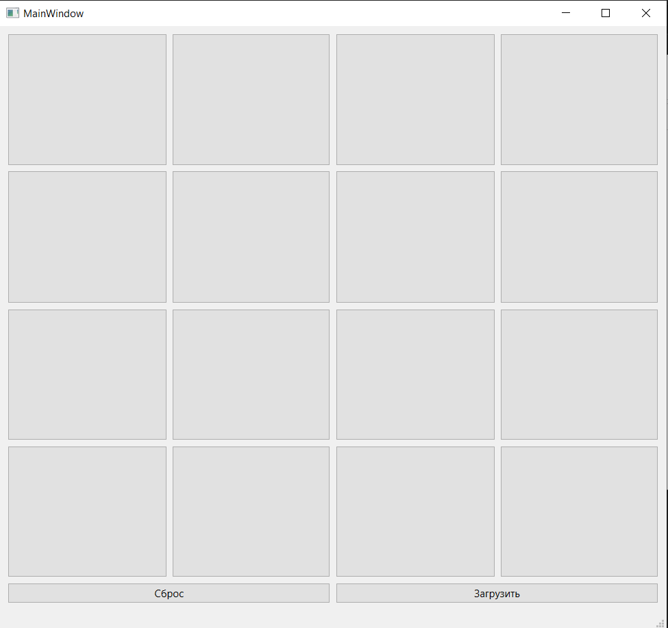
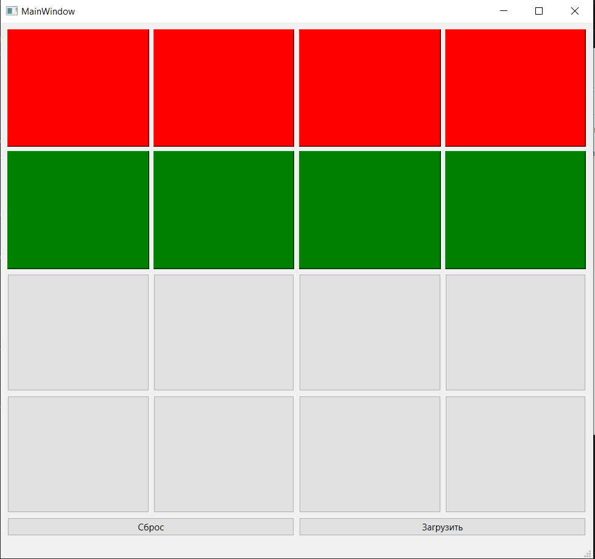
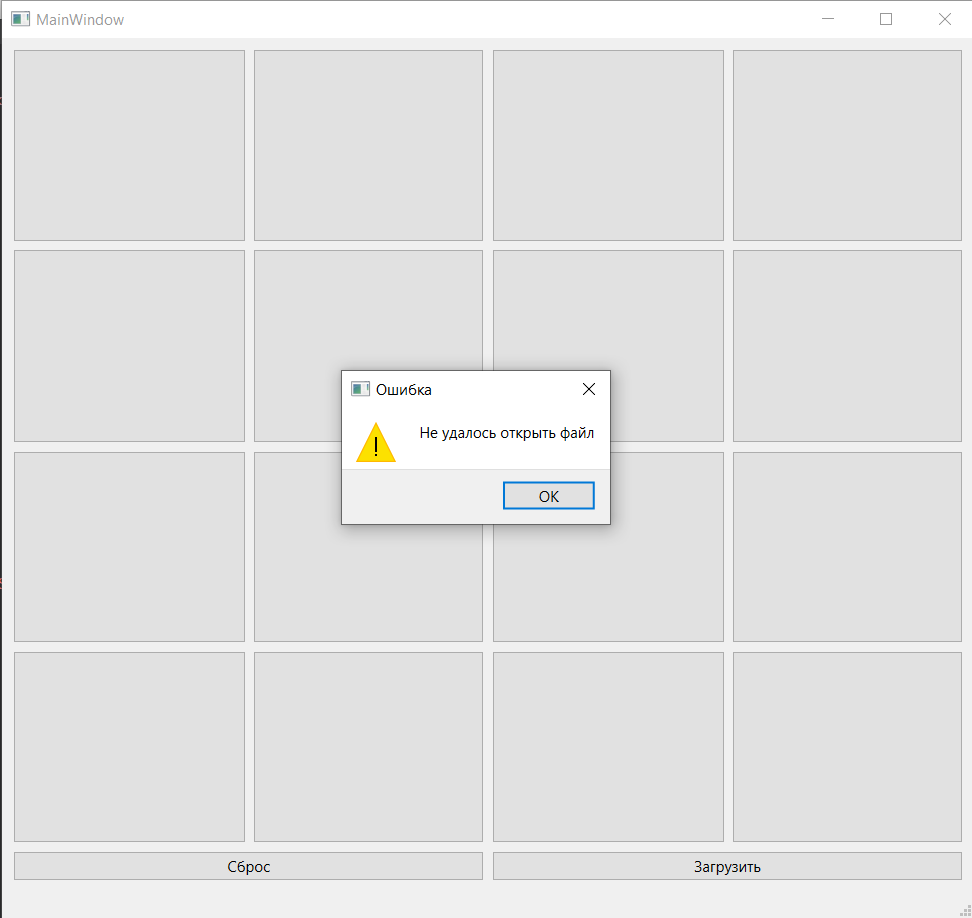
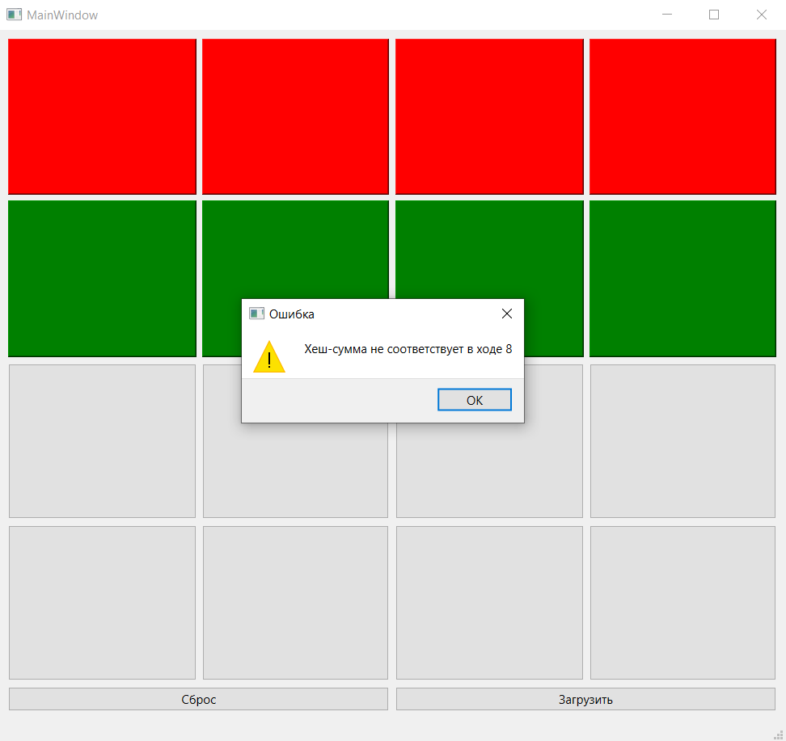

# Приложение-игра с защитой сохранений ходов по технологии блокчейн

## Описание

Приложение представляет собой поле 4х4, а также кнопки "Сброс" и "Загрузить". При нажатии на кнопку она может окраситься в зеленый или красный цвет, в зависимости от четности хода. При нажатии на кнопку "Сброс" кнопки сбрасываются к исходному ненажатому виду, а счётчик нажатий обнуляется. При каждом нажатии кнопки «Загрузить» должен открываться файл состояния игрового поля, при этом состояние игрового поля должно восстанавливаться из файла. В случае, если значение хеш-суммы какого-либо хода не 
соответствует формуле, отображается уведомление, какой по счёту ход в файле привёл к ошибке.

## Функционал

- Нажатие на кнопки и их окрашивание
- Сбрасывание игрового поля
- Загрузка состояния игрового поля из файла
- Проверка хеш-суммы какого-либо хода

## Интерфейс

### Главный экран

### Нажатие кнопок

### Невозможно открыть файл

### Несовпадение хэш-суммы

